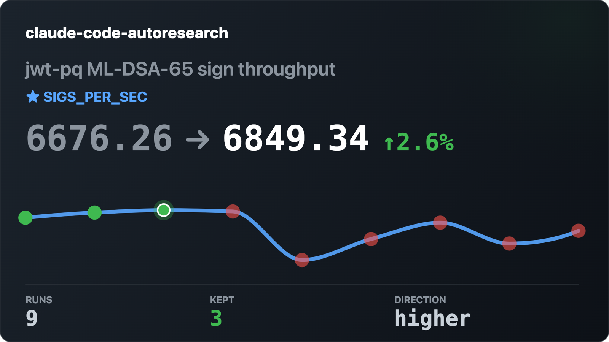

# claude-code-autoresearch

[](https://github.com/marcelopazzo/claude-code-autoresearch/actions/workflows/ci.yml)
[](https://github.com/marcelopazzo/claude-code-autoresearch/releases)
[](LICENSE)
[](https://www.ruby-lang.org)

**Autonomous experiment loop for Claude Code.** Try an idea, measure it, keep what works, discard what doesn't, repeat forever. Built in Ruby, targeted at Rails build optimization but works for any workload.



> **Not affiliated with Anthropic.** Claude Code is a product of Anthropic, PBC. This plugin is an independent extension.

Ruby port of [`davebcn87/pi-autoresearch`](https://github.com/davebcn87/pi-autoresearch) — the original pi extension by [@davebcn87](https://github.com/davebcn87), inspired by [karpathy/autoresearch](https://github.com/karpathy/autoresearch). The design (session files, tool surface, keep/revert loop, confidence scoring) is his; the Claude Code integration and Ruby implementation are this project's.

---

## How the loop works

A handful of rules shape every iteration:

- **One atomic change per iteration.** The agent edits, commits, then calls `run_experiment`. Each row in `autoresearch.jsonl` maps to exactly one commit.
- **Mechanical verification only.** Benchmarks emit `METRIC name=value` lines on stdout. No subjective "did it get better?" — the number decides.
- **Failed runs auto-revert.** `discard`, `crash`, and `checks_failed` reset HEAD to the pre-run commit and clean the working tree. Session files (`autoresearch.*`) are preserved.
- **Correctness can gate `keep`.** If `autoresearch.checks.sh` exists, it runs after each passing benchmark. A failure blocks `keep` unless explicitly forced.
- **JSONL is the source of truth.** Append-only, segment-aware, rebuilt on every tool call — resume-after-crash is free.
- **Confidence is advisory.** MAD-based scoring flags noisy improvements; it never auto-discards.
- **Bounded by `maxIterations`.** Loops stop at the cap (default 50). Set it in `autoresearch.config.json`.

---

## What's included

| | |
|---|---|
| **MCP server** | Typed tools: `init_experiment`, `run_experiment`, `log_experiment` |
| **Skills** | `autoresearch-create` (set up a session and start the loop), `autoresearch-finalize` (split kept experiments into clean branches) |
| **Slash commands** | `/autoresearch <text>`, `/autoresearch off`, `/autoresearch clear`, `/autoresearch export`, `/autoresearch dashboard` |
| **Hooks** | Auto-inject `autoresearch.md` into prompts, auto-resume the loop, session-start warnings |
| **Statusline** | Live run count, best metric, confidence score |
| **Dashboard** | Browser dashboard at `http://localhost:8765` (Rack + Puma); set `AUTORESEARCH_HOST=0.0.0.0` to view from a phone on the same LAN |

---

## Install

**Requirements:** Ruby ≥ 3.1 with Bundler on your PATH.

### 1. Add the marketplace and install the plugin

From a Claude Code session:

```
/plugin marketplace add https://github.com/marcelopazzo/claude-code-autoresearch
/plugin install claude-code-autoresearch@claude-code-autoresearch
```

The first command registers this repo as a single-plugin marketplace; the second installs the plugin from it. The MCP server self-installs its Ruby gems on first launch — no manual `bundle install` needed. If self-install fails (e.g., no network on first run), `mcp/install.sh` inside the installed plugin is the manual fallback.

### 2. (Optional) Enable the statusline

Claude Code doesn't let plugins ship a `statusLine` directly — add it yourself to `~/.claude/settings.json`:

```json
{
  "statusLine": {
    "type": "command",
    "command": "~/.claude/plugins/claude-code-autoresearch/statusline/autoresearch.rb"
  }
}
```

(Adjust the path to match what `/plugin` reports as the install location.)

### 3. (Optional) Rebind Ctrl+X to the dashboard

Copy the snippet from [`keybindings.example.json`](keybindings.example.json) into `~/.claude/keybindings.json` to match the upstream pi-autoresearch keybindings.

### 4. Restart Claude Code

Reload the session so the MCP server, hooks, and (if you added it) statusline are picked up.

---

## Quick start (Rails build optimization)

```
/autoresearch optimize bundle exec rake test runtime, monitor test pass rate
```

The `autoresearch-create` skill asks a few questions (or infers from context), writes `autoresearch.md` + `autoresearch.sh`, runs the baseline, and starts looping. Example `autoresearch.sh` for a Rails test suite:

```bash
#!/bin/bash
set -euo pipefail
START=$(date +%s.%N)
bundle exec rake test > /tmp/ar_test.log 2>&1
END=$(date +%s.%N)
echo "METRIC total_seconds=$(echo "$END - $START" | bc)"
echo "METRIC failures=$(grep -c 'Failure:' /tmp/ar_test.log || true)"
```

The loop runs autonomously: edit → commit → `run_experiment` → `log_experiment` → keep or revert → repeat. Interrupt any time with Esc.

## Finalize into reviewable branches

```
/autoresearch-finalize
```

Groups kept commits into independent branches from the merge-base. Each branch touches a disjoint set of files and can be reviewed and merged on its own.

---

## Files created in your project

| File | Purpose |
|------|---------|
| `autoresearch.md` | Session document — objective, metrics, files in scope, what's been tried. A fresh agent resumes from this alone. |
| `autoresearch.sh` | Benchmark script — pre-checks, runs the workload, prints `METRIC name=number` lines. |
| `autoresearch.jsonl` | Append-only log of every run. Human readable, branch-aware, survives restarts. |
| `autoresearch.checks.sh` | *(optional)* Correctness checks (tests, types, lint). Runs after each passing benchmark. Failures block `keep`. |
| `autoresearch.ideas.md` | *(optional)* Backlog of promising ideas not yet tried. |
| `autoresearch.config.json` | *(optional)* `{ "maxIterations": 50, "workingDir": "..." }` |

---

## Confidence scoring

After 3+ experiments in a session, autoresearch computes a **confidence score** — how the best improvement compares to the session's noise floor (Median Absolute Deviation).

| Confidence | Meaning |
|-----------|---------|
| ≥ 2.0× | Improvement is likely real |
| 1.0–2.0× | Above noise but marginal |
| < 1.0× | Within noise — consider re-running |

Shown in the statusline and on every `log_experiment` response. Advisory only — never auto-discards.

---

## Controlling costs

Autoresearch loops run autonomously and can burn tokens:

- **API key limits** — set budgets in your Anthropic console.
- **`maxIterations`** — cap experiments per session in `autoresearch.config.json`.

---

## Credits

- **[@davebcn87](https://github.com/davebcn87)** — original pi-autoresearch design and reference implementation.
- **Andrej Karpathy** — the [autoresearch](https://github.com/karpathy/autoresearch) idea this builds on.
- **Tobi Lütke** — co-author of upstream pi-autoresearch.

## License

MIT. See [LICENSE](LICENSE).
